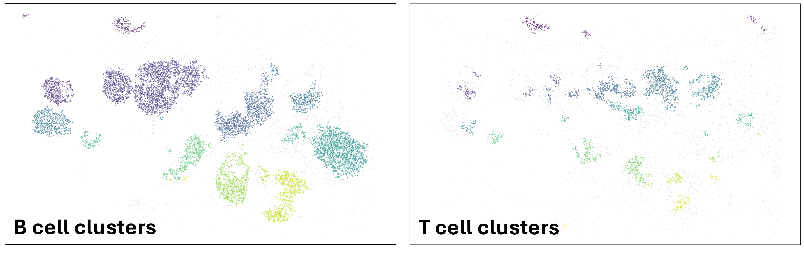

# TLS Snap

## 1. Overview

tls_snap is an automated pipeline for detecting and segmenting tertiary lymphoid structures (TLS) in multiplex immunofluorescence dataset. The method identifies regions of densely packed immune cells using density-based clustering (DBSCAN) and refines the resulting candidate regions to produce TLS boundaries. The pipeline accepts spatial cell coordinate data exported from digital pathology software and exports an annotated version of the input cell dataset, identifying the TLS assignment for every cell.

### Source Code
The source code is currently private while the manuscript is under review. A public release is planned following publication.

## 2. Features
TLS Snap provides a fast, reproducible, and scalable approach for analysing whole-slide images with the following features:

- Automated detection of tertiary lymphoid structures (TLS)
- Modular pipeline with customizable parameters
- Support for large whole-slide datasets
- Batch processing of multiple samples
- Generates TLS polygon annotations and cell level TLS classifications
- Produces quantitative TLS statistics for downstream analysis


## 3. Example results



## 4. Repository structure

```
tls_snap/
├── configs/default.yaml      # Data root and output folder names
├── example_data              # Small example dataset for tutorial 
├── images                    # Images used in the documentation
├── notebooks/                # Notebooks demonstrating workflows
├── src/tls_snap/             # Reusable Python modules
├── environment.yml
└── README.md
```

## 5. Installation

1. Clone the repository:

   ```bash
   git clone https://github.com/shellylin829/tls_snap.git
   cd tls_snap
   ```

2. Create the conda environment:

   ```bash
   conda env create -f environment.yml
   conda activate tls_snap
   ```

3. Configure your data directory.
tls_snap needs to know where your input datasets are stored (See section 6.1). 

## 6. Input Data

TLS Snap operates on spatial cell coordinate data exported from digital pathology software.

Required information includes:

| Column              | Description |
|---------            |-------------|
| X                   | Cell x-coordinate |
| Y                  | Cell y-coordinate |
| phenotype          | Immune cell phenotype |
| Sample Name        | Slide identifier (optional) |

Supported input formats include:
- CSV

Coordinates should be provided in the original image coordinate system.

### 6.1 Working with your own data

Patient imaging data and analysis outputs are **not included** in this repository.

Store your datasets in a location of your choice, for example:

```text
D:/Datasets/TLS_Data/
├── data/          # PID_<sample>_ROI<n>_data.csv files
├── output/        # intermediate phenomap / density outputs
└── figures/       # figures, GeoJSON, results
```

Alternatively, you may keep these folders anywhere that is convenient for your workflow.

Update `configs/default.yaml` (or specify the path when running TLS-SNAP) so that it points to your data directory.
Alternatively, open `configs/default.yaml` and update the `data_root` field to point to your dataset directory.

Example:
**Windows**
```
data_root: D:/Datasets/TLS_data
```

or
**Linux/macOS**
```
data_root: /home/user/Datasets/TLS_data
```

### 6.2 Example Data

**1. Sample (TLS) Dataset**

Small example datasets for `00_getting_started.ipynb` are included in `example_data/`.

**2. Tumour-TLS Dataset**

The whole-slide image dataset for tumour-distance analysis used in `02_application_TLS_tumourDis.ipynb` can be downloaded from

https://github.com/shellylin829/TLS-SNAP/releases/tag/<v1.0.0>

Extract it into `example_data/`


## 7. Quick Start

The `notebooks/00_getting_started.ipynb` notebook demonstrates the TLS Snap workflow using the example dataset.

The tutorial covers:

1. Loading spatial cell data.
2. Visualising cell phenotypes.
3. Identifying B- and T-cell clusters with DBSCAN.
4. Constructing and merging convex hulls to identify TLS regions.
5. Assigning TLS labels to individual cells.
6. Exporting per-cell TLS labels and TLS polygon boundaries.


### 7.1 Running the tutorial

1. Activate the `tls_snap` Conda environment.

   ```bash
   conda activate tls_snap
   ```

2. Launch Jupyter Notebook or JupyterLab.


3. Open `notebooks/00_getting_started.ipynb` and run the cells sequentially from top to bottom.

4. The notebook uses the example dataset in `example_data`. Generated output files are saved to the same path.


<!-- ## Notebook guide

| Notebook | Purpose |
|----------|---------|
| `01_pipeline/phenomap_S1124_ROI_pipeline.ipynb` | Full ROI pipeline: phenomap, DBSCAN, hulls, TLS merge |
| `01_pipeline/phenomap_S1124_ROI_manuscript.ipynb` | Manuscript figures for sample S1124 |
| `02_applications/Application_TLS_composition.ipynb` | TLS cellular composition |
| `02_applications/Application_TLS_tumourDis.ipynb` | TLS vs tumour distance |
| `03_sensitivity/sensitivity_analysis_batch.ipynb` | Batch sensitivity across patients |
| `03_sensitivity/sensitivity_analysis_roi_visual.ipynb` | ROI-level sensitivity visuals |
| `04_scripts/script_k_distance_plot.ipynb` | DBSCAN epsilon tuning (k-distance) |
| `04_scripts/script_TLS_manuscript_cropping.ipynb` | ROI cropping utilities |
| `04_scripts/script_find_specific_TLS.ipynb` | Locate specific TLS instances |
 -->

## 8. Citation

If you use tls_snap in your research, please cite the associated manuscript (details to be added).


```text
@article{lin2026tlssnap,
  author = {Lin, Shelly C. Y., Munoz-Erazo, Luis, Park, Saem Mul, Chen, Jenni Chun-Jen, Eom, Jennifer, Zhou, Lisa, Dunbar, P. Rod},
  title = {TLS Snap: A Density-Based Segmentation of Tertiary Lymphoid Structures in Whole Slide Images},
  journal = {},
  volume = {},
  number = {},
  pages = {},
  year = {2026},
  doi = {},
  url = {}
}
```

## License

MIT — see `LICENSE`.
